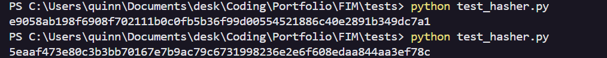
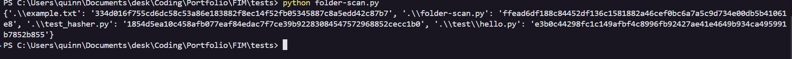
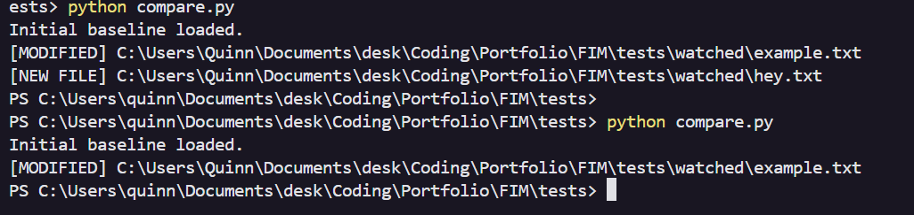
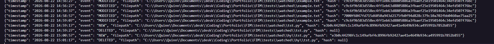
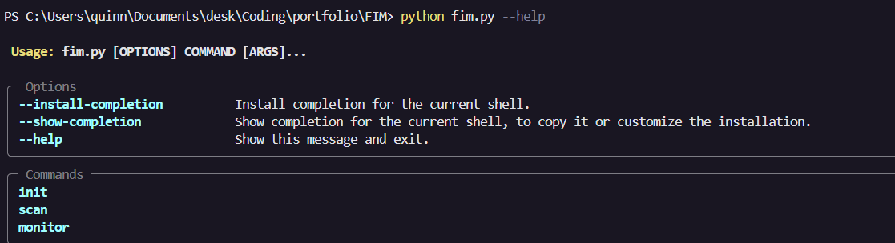

# File Integrity Monitor (FIM)

## Overview

I created an File Integrity Monitoring (FIM) application that detects changes
to files within specified directories/folders.

The application uses SHA-256 hashes to create a baseline
of all files in the specified location and detects:

- New files
- Modified files
- Deleted files

Detected changes are timestamped and recorded as security events.

I worked in steps for this project to make sure i test everything per step to ensure no big troubleshooting has to happen when the project is complete

## Goals

The goal of this project is to build a FIM application that:

- Works on Windows and Linux
- Creates a trusted file-hash baseline
- Detects new, modified, and deleted files
- Records detected events with timestamps
- Continuously monitors a directory
- Stores events in a structured log
- Usable trough a CLI interface
- Can eventually provide notifications

## Technologies

- Python
- SHA-256
- JSON
- Typer
- Git

## How It Works

The application follows this general process:

1. Scan the specified directory
2. Calculate a SHA-256 hash for each file
3. Store the hashes as a trusted baseline
4. Scan the directory again
5. Compare the current hashes against the baseline
6. Detect new, modified, and deleted files
7. Generate timestamped security events
8. Store events in a log
9. Continuously monitor the directory when monitoring mode is enabled

## Development Process

### V1 - File Hashing
I created a SHA-256 hasing function that creates an hash from a specified file.
This is the first step to creating a Functionablt FIM application because the res tbuild on top of this.
The code also reads files in binary mode and chuncks this is usefull if there are big files

     

### V2 - Folder Scanning
I used the os.walk() function from os for recursive directory scanning which is needed to map out all files in a directory including files in sub directoriys. 
Building on previous step it then hashes all files and displays the hash per filepath

     

### V3 - Baseline
Creating a baseline json file function and loading function to have it stored

The baseline represents the trusted state of the monitored directory.

### V4 - Change Detection
Based on the comparison done from the current hashed files and the baseline which is a json file display the directory states:

The application can detect:

- `[NEW]` New files
- `[MODIFIED]` Modified files
- `[DELETED]` Deleted files

     

### V5 - Continuous Monitoring

Implemented continuous directory monitoring with a configurable scan
interval.

The monitor maintains the current state in memory to prevent the same
change from being reported repeatedly during subsequent scans.

### V6 - Security Event Logging

Implemented structured events containing:

- Timestamp
- Event type
- File path
- File hash

  

### V7 - CLI

Implemented Typer for CLI commands

- `init` - Create a baseline
- `scan` - Perform a single comparison
- `monitor` - Continuously monitor the directory

  